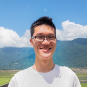
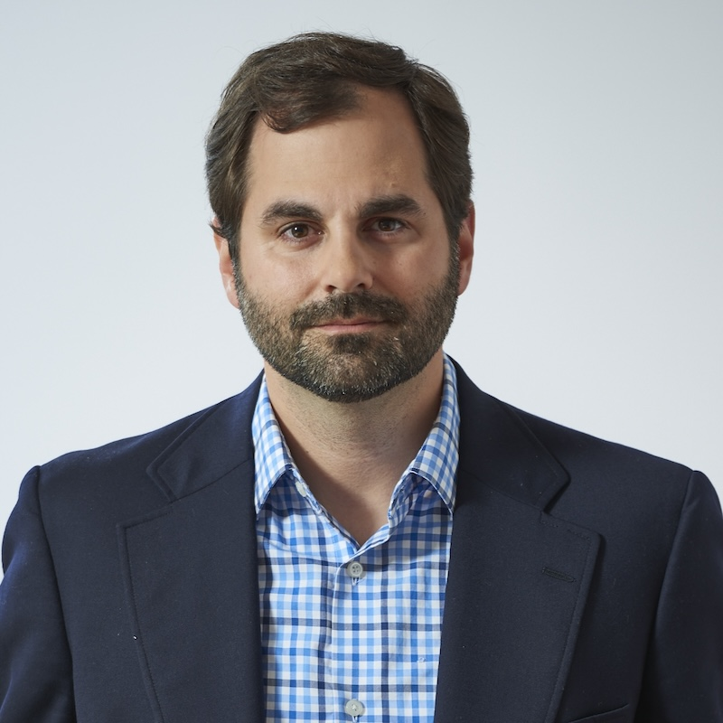
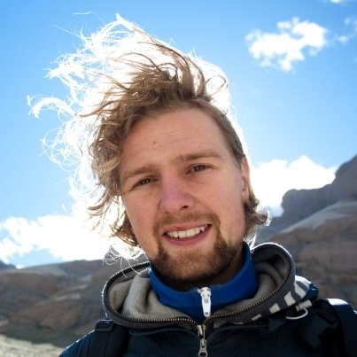
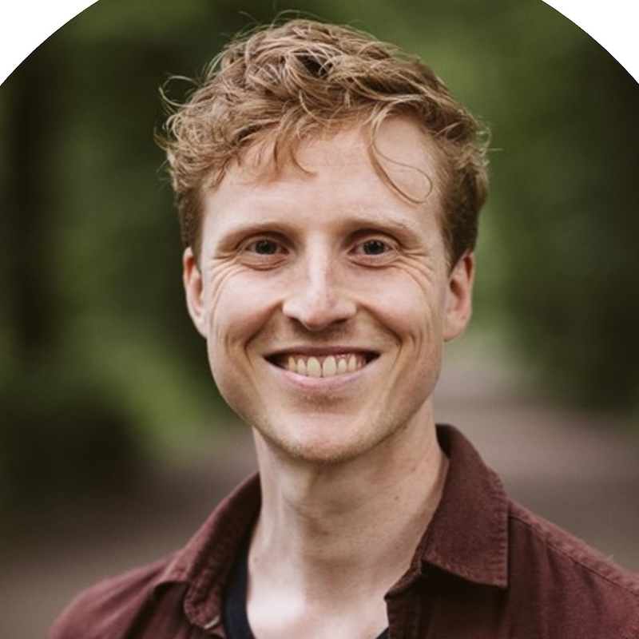
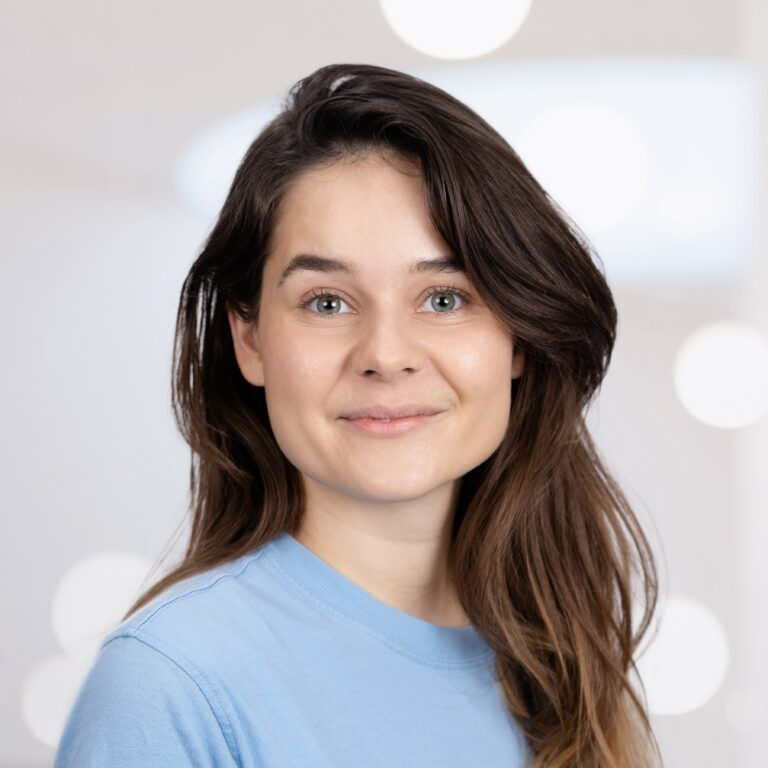
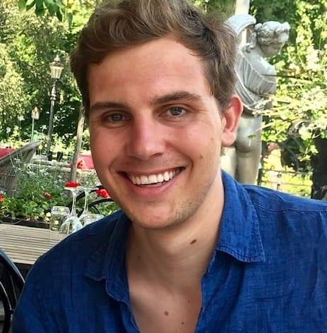
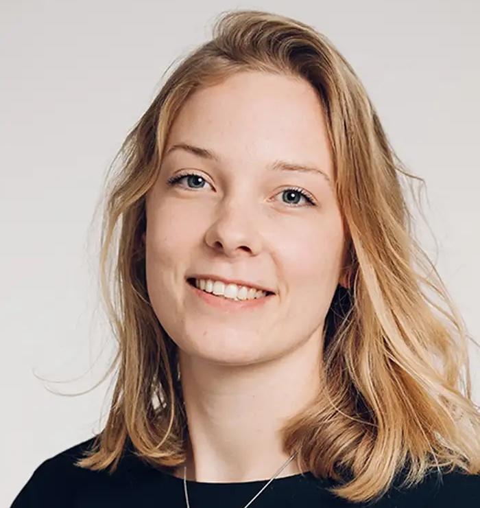

# Speaker Info

Under construction!

|  Speaker&nbsp;&nbsp;&nbsp;&nbsp;&nbsp;&nbsp;&nbsp;&nbsp;&nbsp;&nbsp;&nbsp;&nbsp;&nbsp;&nbsp;&nbsp;&nbsp;&nbsp;&nbsp;&nbsp;&nbsp;&nbsp;&nbsp;&nbsp;&nbsp;&nbsp;&nbsp;&nbsp;&nbsp;&nbsp;&nbsp;&nbsp;&nbsp;&nbsp;&nbsp;&nbsp;&nbsp;&nbsp;&nbsp;&nbsp; |  Bio                                                                                       |
|---------------------------------------|--------------------------------------------------------------------------------------------|
|  George Kachergis | __[George Kachergis](https://www.kachergis.com/)__ (organizer) is a research scientist at Stanford University. He has studied language acquisition with psychometric models as well as process-based cognitive models of memory and self-directed learning. |
|  Alvin Wei Ming Tan | __Alvin Wei Ming Tan__ (organizer) is a Ph.D. student in Psychology at Stanford University. He has worked with item response theoretic models of word learning across different language contexts. |
|  Michael C. Frank | __[Michael C. Frank](https://web.stanford.edu/~mcfrank/)__ (organizer) is Benjamin Scott Crocker Professor of Human Biology at Stanford University. His work combines the creation of computational models of language development with efforts to create and curate larger datasets to constrain these models. |
|  Abe Hofman | __Abe Hofman__ (speaker) is an Assistant Professor at the Psychological Methods group at the University of Amsterdam. He works on algorithms for adaptive learning systems and modelling the large log data to understand learning. |
|  Stefan Vermeent | __[Stefan Vermeent](https://www.stefan-vermeent.nl/)__ (speaker) is a Ph.D. candidate at Utrecht University and the Max Planck Institute for the Study of Crime, Security, and Law. His work focuses on better understanding cognitive adaptations to adversity using cognitive modeling. |
|  Jill de Ron | __Jill de Ron__ (speaker) is a Ph.D. student at the University of Amsterdam. As part of the Theory Methods Lab, she works to advance the methodology of formal theory construction in psychology. Her recent work has focused on translating resource competition models from ecology to cognitive development. |
|  Nicholas Judd | __[Nicholas Judd](https://www.njudd.com/)__ (speaker) is a postdoctoral researcher at the Donders Institute for Mind, Brain, and Behaviour. His work applies psychometric models to study the development of cognition, with a particular focus on environmental impacts. |
|  Jessica Schaaf | __Jessica Schaaf__ (speaker) is a postdoctoral researcher in Cognitive Neuroscience at the Radboud University Medical Center. She works on extending time-series models to capture individual variability in the development of cognitive abilities. |